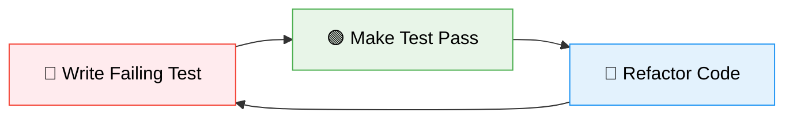

<div align="center">

# 🚀 Jordy van Vorselen | Portfolio

> **A modern, responsive portfolio website built with cutting-edge web technologies and test-driven development principles**

[](https://nextjs.org/)
[](https://www.typescriptlang.org/)
[](https://tailwindcss.com/)
[](https://jestjs.io/)
[](https://playwright.dev/)

_Showcasing professional expertise through exceptional user experience and bulletproof code quality_

</div>

## ✨ About This Project

This portfolio website represents the intersection of **exceptional design**, **bulletproof engineering**, and **cutting-edge web technologies**. Built with Test-Driven Development (TDD) principles, every component is thoroughly tested with 100% code coverage, ensuring reliability and maintainability.

The project demonstrates expertise in modern frontend development, featuring a carefully crafted user experience that seamlessly adapts across all device sizes while maintaining pixel-perfect design fidelity.

## 🛠️ Technology Stack

<div align="center">

| Category                  | Technologies                                                                                                                                                          |
| ------------------------- | --------------------------------------------------------------------------------------------------------------------------------------------------------------------- |
| **Frontend Framework**    |                                                                                      |
| **Language**              |                                                                            |
| **Styling**               |                                                                   |
| **Component Library**     |                                                                                    |
| **Icons**                 |                                                                      |
| **Testing (Unit)**        |                                                                                  |
| **Testing (Integration)** |                                                                            |
| **Code Quality**          |   |
| **Package Manager**       |                                                                                       |

</div>

## 📁 Project Architecture

This project follows a **domain-driven architecture** with clear separation of concerns:

```
📦 Portfolio
├── 🚀 app/                      # Next.js App Router
│   ├── layout.tsx               # Root layout & metadata
│   ├── page.tsx                 # Home page
│   └── api/                     # API routes
├── 🎨 src/
│   ├── ui/                      # 🧩 Generic UI Components
│   │   ├── Badge.tsx            # Design system badges
│   │   ├── Text.tsx             # Typography system
│   │   ├── SocialIcon.tsx       # Social media icons
│   │   └── NavigationLink.tsx   # Navigation links
│   └── domains/                 # 🏗️ Feature Domains
│       ├── header/              # Navigation & branding
│       ├── hero-section/        # Landing introduction
│       └── expertise-section/   # Skills showcase
├── 🧪 integration-tests/        # E2E Testing Suite
│   ├── pages/                   # Page Object Models
│   └── fixtures/                # Test fixtures
├── 🔧 hooks/                    # Custom React hooks
├── 📚 lib/                      # Utilities & helpers
└── 🎯 public/                   # Static assets
```

### 🏗️ Domain-Based Architecture

**Design System First**: Every UI pattern is first created as a reusable component in `src/ui/` with comprehensive variant systems, then utilized across domain-specific features.

**Domain Separation**: Features are organized by business domains, each containing components specific to that functionality while leveraging shared UI components.

## 🧪 Testing Strategy

This project maintains **100% code coverage** through a comprehensive three-tier testing strategy:

### 🔴 Unit Testing (Jest + React Testing Library)

- **Coverage**: 100% code coverage mandatory
- **Focus**: Component behavior and business logic
- **Location**: Co-located with components (`*.spec.tsx`)
- **Run**: `pnpm test:unit`

```bash
✅ 42 unit tests passing
✅ 100% code coverage maintained
```

### 🟡 Integration Testing (Playwright)

- **Pattern**: Page Object Model (POM) mandatory
- **Focus**: User workflows and component interactions
- **Location**: `integration-tests/` directory
- **Run**: `pnpm test:integration`

```bash
✅ 36 integration tests passing
✅ Chrome & Firefox coverage
✅ Page Object Model enforced
```

### 🟢 Visual Regression Testing (Playwright Screenshots)

- **Purpose**: Pixel-perfect design fidelity
- **Method**: Automated screenshot comparisons
- **Baseline**: Generated with `--update-snapshots`
- **Coverage**: All major UI sections

```bash
✅ Visual regression tests
✅ Multi-browser screenshot validation
✅ Automated baseline management
```

## 🔄 Test-Driven Development Workflow

Following **Kent Beck's TDD principles** and **Tidy First** methodology:

### Red → Green → Refactor Cycle



1. **🔴 Red**: Write the smallest possible failing test
2. **🟢 Green**: Implement minimal code to make test pass
3. **🔵 Refactor**: Improve code structure while maintaining green tests

### Commit Discipline

- ✅ Commit after reaching **Green** state
- ✅ Commit after **Refactoring** phase
- ✅ Separate structural from behavioral changes
- ✅ Conventional commit format enforced

## 🚀 Getting Started

### Prerequisites

- **Node.js** 18.17 or later
- **pnpm** (recommended package manager)

### Installation

```bash
# Clone the repository
git clone https://github.com/jordyvanvorselen/portfolio.git
cd portfolio

# Install dependencies
pnpm install

# Start development server
pnpm dev
```

🌐 Open [http://localhost:3000](http://localhost:3000) to view the portfolio.

### Development Commands

| Command                 | Description                  |
| ----------------------- | ---------------------------- |
| `pnpm dev`              | 🔥 Start development server  |
| `pnpm build`            | 🏗️ Build for production      |
| `pnpm start`            | ▶️ Start production server   |
| `pnpm test`             | 🧪 Run all tests             |
| `pnpm test:unit`        | 🔬 Run unit tests only       |
| `pnpm test:integration` | 🌐 Run integration tests     |
| `pnpm lint`             | 🔍 Check code quality        |
| `pnpm lint:fix`         | 🛠️ Fix linting issues        |
| `pnpm format`           | ✨ Format code with Prettier |

## 📊 Code Quality Metrics

<div align="center">

| Metric            | Status                                                                           |
| ----------------- | -------------------------------------------------------------------------------- |
| **Test Coverage** |                 |
| **Type Safety**   |  |
| **Linting**       |        |
| **Code Style**    |            |
| **Build Status**  |                |

</div>

## 🎯 Design Philosophy

- **🎨 Pixel-Perfect Design**: Every element precisely matches design specifications
- **📱 Mobile-First**: Responsive design ensuring exceptional experience on all devices
- **♿ Accessibility**: WCAG compliant with proper ARIA labels and semantic HTML
- **⚡ Performance**: Optimized for Core Web Vitals and SEO
- **🧩 Component Reusability**: Design system approach with comprehensive variant systems
- **🔒 Type Safety**: Comprehensive TypeScript coverage with strict mode enabled

---

<div align="center">

**Built with ❤️ by [Jordy van Vorselen](https://github.com/jordyvanvorselen)**

_Showcasing the perfect blend of exceptional design, robust engineering, and test-driven development_

</div>
