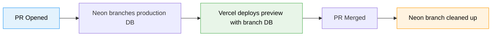

<div align="center">

# 🚀 Jordy van Vorselen | Portfolio

> **A modern, responsive portfolio website built with cutting-edge web technologies and test-driven development principles**

[](https://nextjs.org/)
[](https://www.typescriptlang.org/)
[](https://tailwindcss.com/)
[](https://vitest.dev/)
[](https://playwright.dev/)

_Showcasing professional expertise through exceptional user experience and bulletproof code quality_

</div>

## ✨ About This Project

This portfolio website represents the intersection of **exceptional design**, **bulletproof engineering**, and **cutting-edge web technologies**. Built with Test-Driven Development (TDD) principles, every component is thoroughly tested with 100% code coverage, ensuring reliability and maintainability.

The project demonstrates expertise in modern frontend development, featuring a carefully crafted user experience that seamlessly adapts across all device sizes while maintaining pixel-perfect design fidelity.

## 🛠️ Technology Stack

<div align="center">

| Category                  | Technologies                                                                                                                                                                       |
| ------------------------- | ---------------------------------------------------------------------------------------------------------------------------------------------------------------------------------- |
| **Frontend Framework**    |                         |
| **Language**              |                                                                                   |
| **Styling**               |                                                                          |
| **Component Library**     |                                                                                                 |
| **CMS**                   |                                                                                                 |
| **Internationalization**  |                                                                                                       |
| **Icons**                 |                           |
| **Testing (Unit)**        |    |
| **Testing (Integration)** |                                                                                  |
| **API Mocking**           |                                                                                      |
| **Analytics**             |                                                                                             |
| **Code Quality**          |   |
| **Package Manager**       |                                                                                                    |

</div>

## 📁 Project Architecture

This project follows a **domain-driven architecture** with clear separation of concerns:

```
📦 Portfolio
├── 🚀 src/app/                  # Next.js App Router
│   ├── (site)/                  # Public site route group
│   │   ├── layout.tsx           # Site layout & metadata
│   │   ├── page.tsx             # Home page
│   │   ├── blog/                # Blog pages
│   │   ├── experience/          # Experience pages
│   │   ├── projects/            # Projects pages
│   │   └── globals.css          # Global styles & utility classes
│   └── (payload)/               # Payload CMS admin route group
│       ├── admin/               # CMS admin panel
│       └── api/                 # CMS API routes
├── 🎨 src/
│   ├── ui/                      # 🧩 Generic UI Components (28 components)
│   │   ├── Accordion.tsx        # Expandable content sections
│   │   ├── Badge.tsx            # Design system badges
│   │   ├── Button.tsx           # Interactive buttons
│   │   ├── Card.tsx             # Content containers
│   │   ├── DevIcon.tsx          # Technology/developer icons
│   │   ├── Divider.tsx          # Visual separators
│   │   ├── Filter.tsx           # Content filtering
│   │   ├── FlagIcon.tsx         # Country flag icons
│   │   ├── LanguageSwitcher.tsx # i18n language selection
│   │   ├── Logo.tsx             # Branding logo
│   │   ├── MermaidDiagram.tsx   # Mermaid chart rendering
│   │   ├── NavigationLink.tsx   # Navigation links
│   │   ├── PayloadRichText.tsx  # CMS rich text rendering
│   │   ├── SectionBackground.tsx# Section background styling
│   │   ├── SocialIcon.tsx       # Social media icons
│   │   ├── Text.tsx             # Typography system
│   │   ├── Title.tsx            # Heading system
│   │   ├── Timeline*.tsx        # Timeline components
│   │   └── ZoomControls.tsx     # Zoom pan pinch controls
│   ├── domains/                 # 🏗️ Feature Domains
│   │   ├── common/              # Shared components (Header, Footer, MobileMenu)
│   │   ├── home/                # Home page features
│   │   │   ├── hero/            # Landing introduction & social links
│   │   │   ├── expertise/       # Skills showcase & expertise cards
│   │   │   ├── skills/          # Technical skills display
│   │   │   └── faq/             # Frequently asked questions
│   │   ├── blog/                # Blog functionality & search
│   │   ├── experience/          # Experience timeline & cards
│   │   └── projects/            # Projects showcase & collaboration
│   ├── collections/             # 📦 Payload CMS collections
│   ├── lib/                     # 📚 Client helpers & API wrappers
│   ├── i18n/                    # 🌐 Internationalization
│   │   ├── config.ts            # i18n configuration
│   │   ├── request.ts           # Server-side i18n utilities
│   │   └── locales/             # Translation files (en.json, nl.json)
│   ├── assets/images/           # 📸 Optimized images & logos
│   ├── types/                   # 📝 TypeScript type definitions
│   ├── hooks/                   # 🔧 Custom React hooks
│   └── utils/                   # 📚 Utility functions
├── 🧪 integration-tests/        # E2E Testing Suite
│   ├── page-objects/            # Page Object Model Architecture
│   │   ├── pages/               # Page-level objects (HomePage, BlogPage)
│   │   ├── sections/            # Section-level objects (Header, Hero, Blog)
│   │   ├── base.page.ts         # Abstract base class for pages
│   │   └── base.section.ts      # Abstract base class for sections
│   ├── fixtures/                # Test fixtures & dependency injection
│   └── __screenshots__/         # Visual regression baselines
└── 🎯 public/                   # Static assets & favicons
```

### 🏗️ Domain-Based Architecture

**Design System First**: Every UI pattern is first created as a reusable component in `src/ui/` with comprehensive variant systems, then utilized across domain-specific features.

**Domain Separation**: Features are organized by business domains, each containing components specific to that functionality while leveraging shared UI components.

### 🌐 Internationalization & Mobile-First Design

**Multi-Language Support**: Built with `next-intl` providing seamless English/Dutch language switching with:

- Server-side rendering support for SEO optimization
- Cookie-based language persistence across sessions
- Type-safe translation keys with TypeScript integration
- Dedicated translation files in `src/i18n/locales/`

**Mobile-First Experience**: Responsive design with dedicated mobile components:

- Hamburger menu with smooth animations and overlay
- Touch-friendly navigation and interactions
- Optimized layouts for all device sizes
- Progressive enhancement from mobile to desktop

## 📝 Blog & Content Management

  

The blog is powered by **Payload CMS** backed by **Neon** (serverless PostgreSQL), using the **Lexical** rich text editor for content authoring and **Vercel Blob** for media storage. Payload's Local API bypasses the HTTP layer entirely — data flows directly from the database through a transform/API layer into React components.

**Blog Features:**

- Search and tag-based filtering for discovering posts
- Featured posts and estimated read time
- Syntax highlighting with **Shiki** and **Mermaid** diagram support
- Draft previews for unpublished content
- Full i18n support (English & Dutch)

**Preview Deploy Database Branching:**

Each pull request gets its own isolated database, so preview deploys never touch production data:



## 🧪 Testing Strategy

This project maintains **100% code coverage** through a comprehensive three-tier testing strategy:

### 🔴 Unit Testing (Vitest + React Testing Library + MSW)

- **Coverage**: 100% code coverage mandatory
- **Focus**: Component behavior and business logic
- **Location**: Co-located with components (`*.spec.tsx`)
- **API Mocking**: MSW (Mock Service Worker) for realistic API interactions
- **Run**: `pnpm test:unit`

```bash
✅ 808 unit tests passing
✅ 100% code coverage maintained
```

### 🟡 Integration Testing (Playwright + MSW)

- **Architecture**: Section-based Page Object Model (POM) with `BasePage`/`BaseSection` pattern
- **Focus**: User workflows and component interactions with proper element scoping
- **Location**: `integration-tests/page-objects/` directory with organized structure
- **API Mocking**: MSW (Mock Service Worker) for consistent test data
- **Browsers**: Chrome & Firefox (WebKit excluded due to MSW compatibility)
- **Run**: `pnpm test:integration`

```bash
✅ 101 integration tests passing
✅ Chrome & Firefox coverage
✅ Section-based page object architecture
✅ Strict mode violation prevention
```

**Page Object Architecture Features:**

- **Section Scoping**: All locators properly scoped to prevent element ambiguity
- **Base Classes**: Abstract `BasePage` and `BaseSection` for consistent patterns
- **Separation of Concerns**: Common sections in `BasePage`, page-specific in page classes
- **Type Safety**: Full TypeScript support with proper typing
- **Fixtures**: Dependency injection for clean test setup

### 🟢 Visual Regression Testing (Playwright Screenshots)

- **Purpose**: Pixel-perfect design fidelity across browsers and devices
- **Method**: Automated screenshot comparisons with baseline images
- **Coverage**: Header, Hero, Expertise, Blog sections with dedicated visual tests
- **Browsers**: Chrome & Firefox with platform-specific baselines
- **Storage**: Baselines in `integration-tests/__screenshots__/` directory

```bash
✅ 18 visual regression tests passing
✅ Visual regression tests for major UI sections
✅ Multi-browser screenshot validation (Chrome/Firefox)
✅ Automated baseline management with --update-snapshots
✅ CI/CD integration with artifact upload for failures
✅ Platform-specific baseline generation (Linux CI, macOS dev)
```

**Visual Testing Features:**

- **Section-based Screenshots**: Each major UI section has dedicated visual tests
- **Browser Coverage**: Platform-specific baselines for Chrome and Firefox
- **CI Integration**: Automatic snapshot validation in GitHub Actions
- **Failure Artifacts**: Test results uploaded as CI artifacts for debugging

### 🌐 API Mocking with Mock Service Worker (MSW)

**Professional-Grade API Mocking**: This project leverages **Mock Service Worker (MSW)** for seamless API mocking across all environments, ensuring consistent and reliable data handling throughout the development lifecycle.

```mermaid
graph TD
    A[🌐 MSW Service Worker] --> B[🔧 Development Server]
    A --> C[🧪 Unit Tests]
    A --> D[🎭 Integration Tests]

    B --> E[📊 Realistic API Responses]
    C --> E
    D --> E

    E --> F[✅ Consistent Test Data]
    E --> G[🚀 Offline Development]
    E --> H[🔄 Reproducible Scenarios]

    style A fill:#ff6a33,stroke:#ffffff,color:#ffffff
    style E fill:#e8f5e8,stroke:#4caf50,color:#000000
    style F fill:#e3f2fd,stroke:#2196f3,color:#000000
    style G fill:#fff3e0,stroke:#ff9800,color:#000000
    style H fill:#f3e5f5,stroke:#9c27b0,color:#000000
```



**MSW Integration Features:**

- **🔄 Universal Coverage**: Single mock definitions shared across dev server, unit tests, and integration tests
- **🎯 Request Interception**: Browser-level network interception for authentic API simulation
- **📊 Dynamic Responses**: Configurable mock data generation with realistic scenarios
- **🛠️ Development Server**: Offline development with complete API simulation
- **🧪 Test Consistency**: Identical mock responses across all test environments
- **🚀 Hot Reloading**: Instant mock updates during development
- **📁 Organized Structure**: Centralized mock definitions in `test/msw/` directory

**Mock Architecture:**

```typescript
// test/msw/defaultHandlers.ts - Centralized API mocks
// Note: Payload Local API doesn't require HTTP mocking.
// Mock data is returned directly from api.ts when NEXT_PUBLIC_MOCK_BACKEND='true'
export const defaultHandlers: never[] = []

// MSW is used for browser-level request interception in:
// - Development server (browser)
// - Integration tests (Playwright via @msw/playwright)
```

The project uses **Payload CMS** with its Local API, which bypasses HTTP entirely for data access. Mock data is served through the application's own API layer (`NEXT_PUBLIC_MOCK_BACKEND='true'`), while MSW handles browser-level request interception for development and integration testing.

## 🔄 Test-Driven Development Workflow

Following **Kent Beck's TDD principles** and **Tidy First** methodology:

### Red → Green → Refactor Cycle

```mermaid
graph LR
    A[🔴 Write Failing Test] --> B[🟢 Make Test Pass]
    B --> C[🔵 Refactor Code]
    C --> A

    style A fill:#ffebee,stroke:#f44336,color:#000000
    style B fill:#e8f5e8,stroke:#4caf50,color:#000000
    style C fill:#e3f2fd,stroke:#2196f3,color:#000000
```



1. **🔴 Red**: Write the smallest possible failing test
2. **🟢 Green**: Implement minimal code to make test pass
3. **🔵 Refactor**: Improve code structure while maintaining green tests

### Commit Discipline

- ✅ Commit after reaching **Green** state
- ✅ Commit after **Refactoring** phase
- ✅ Separate structural from behavioral changes
- ✅ Conventional commit format enforced

## 🚀 Getting Started

### Prerequisites

- **Node.js** 18.17 or later
- **pnpm** (recommended package manager)

### Installation

```bash
# Clone the repository
git clone https://github.com/jordyvanvorselen/portfolio.git
cd portfolio

# Install dependencies
pnpm install

# Start development server
pnpm dev
```

🌐 Open [http://localhost:3000](http://localhost:3000) to view the portfolio.

### Development Commands

| Command                           | Description                                    |
| --------------------------------- | ---------------------------------------------- |
| `pnpm dev`                        | 🔥 Start development server (Turbopack)        |
| `pnpm build`                      | 🏗️ Build for production                        |
| `pnpm start`                      | ▶️ Start production server                     |
| `pnpm test`                       | 🧪 Run all tests (unit + integration + visual) |
| `pnpm test:unit`                  | 🔬 Run unit tests with coverage                |
| `pnpm test:integration`           | 🌐 Run integration tests (Docker)              |
| `pnpm test:visual-regression`     | 🖼️ Run visual regression tests                 |
| `pnpm test:visual-regression:fix` | 🔧 Update visual regression baselines          |
| `pnpm lint`                       | 🔍 Check code quality & formatting             |
| `pnpm lint:fix`                   | 🛠️ Fix linting & formatting issues             |
| `pnpm format`                     | ✨ Check code formatting                       |
| `pnpm format:fix`                 | 🎨 Fix code formatting                         |

## 🔄 CI/CD Pipeline

This project uses **GitHub Actions** for continuous integration and deployment with a comprehensive quality gate system:

### 🛠️ Workflow Overview

```mermaid
graph LR
    A[Push/PR] --> B[Lint & Format]
    A --> C[Build Verification]
    A --> D[Type Checking]
    A --> E[Unit Tests]
    A --> F[Integration Tests]
    A --> G[Visual Regression Tests]

    B --> H[Deploy Gate]
    C --> H
    D --> H
    E --> H
    F --> H
    G --> H

    H --> I[🚀 Vercel Deployment]

    style A fill:#e3f2fd,stroke:#2196f3,color:#000000
    style H fill:#fff3e0,stroke:#ff9800,color:#000000
    style I fill:#e8f5e8,stroke:#4caf50,color:#000000
```



### ⚡ Pipeline Stages

| Stage                    | Purpose                          | Tools             | Status                                                                 |
| ------------------------ | -------------------------------- | ----------------- | ---------------------------------------------------------------------- |
| **🔍 Lint & Format**     | Code style & quality enforcement | ESLint + Prettier |       |
| **🏗️ Build**             | Application build verification   | Next.js           |        |
| **📋 Typecheck**         | Static type analysis             | TypeScript        |           |
| **🧪 Unit Tests**        | Component & logic testing        | Vitest + RTL      |      |
| **🌐 Integration Tests** | E2E testing workflows            | Playwright        |  |
| **🖼️ Visual Regression** | Visual regression testing        | Playwright        |   |

### 🎯 Key Features

- **✅ Quality Gates**: All stages must pass before deployment
- **🔍 Pre-commit Hooks**: Automatic linting and formatting on commit
- **🚀 Playwright Browser Caching**: Optimized CI performance with browser cache
- **📁 Artifact Management**: Test results uploaded for 30-day retention
- **🔄 Environment-based Deployment**: Production (main) vs Preview (PRs)
- **⚡ Composite Actions**: Reusable Node.js/pnpm setup action
- **🛡️ Security**: Vercel deployment with encrypted secrets

### 🚀 Deployment Strategy

**Production Deployment** (main branch):

- Triggered on push to `main`
- Full quality gate validation (lint, build, typecheck, tests)
- Deployed to production Vercel environment

**Preview Deployment** (PRs):

- Triggered on pull request creation/updates
- Same quality validation as production
- Deployed to unique preview URL for review

## 📊 Code Quality Metrics

<div align="center">

| Metric            | Status                                                                           |
| ----------------- | -------------------------------------------------------------------------------- |
| **Test Coverage** |                 |
| **Type Safety**   |  |
| **Linting**       |        |
| **Code Style**    |            |
| **Build Status**  |                |

</div>

## 🎯 Design Philosophy

- **🎨 Pixel-Perfect Design**: Every element precisely matches design specifications
- **📱 Mobile-First**: Responsive design ensuring exceptional experience on all devices
- **♿ Accessibility**: WCAG compliant with proper ARIA labels and semantic HTML
- **⚡ Performance**: Optimized for Core Web Vitals and SEO
- **🧩 Component Reusability**: Design system approach with comprehensive variant systems
- **🔒 Type Safety**: Comprehensive TypeScript coverage with strict mode enabled

---

<div align="center">

**Built with ❤️ by [Jordy van Vorselen](https://github.com/jordyvanvorselen)**

_Showcasing the perfect blend of exceptional design, robust engineering, and test-driven development_

</div>
