<div align="center">

# 🚀 Jordy van Vorselen | Portfolio

> **A modern, responsive portfolio website built with cutting-edge web technologies and test-driven development principles**

[](https://nextjs.org/)
[](https://www.typescriptlang.org/)
[](https://tailwindcss.com/)
[](https://jestjs.io/)
[](https://playwright.dev/)

_Showcasing professional expertise through exceptional user experience and bulletproof code quality_

</div>

## ✨ About This Project

This portfolio website represents the intersection of **exceptional design**, **bulletproof engineering**, and **cutting-edge web technologies**. Built with Test-Driven Development (TDD) principles, every component is thoroughly tested with 100% code coverage, ensuring reliability and maintainability.

The project demonstrates expertise in modern frontend development, featuring a carefully crafted user experience that seamlessly adapts across all device sizes while maintaining pixel-perfect design fidelity.

## 🛠️ Technology Stack

<div align="center">

| Category                  | Technologies                                                                                                                                                          |
| ------------------------- | --------------------------------------------------------------------------------------------------------------------------------------------------------------------- |
| **Frontend Framework**    |                                                                                      |
| **Language**              |                                                                            |
| **Styling**               |                                                                   |
| **Component Library**     |                                                                                    |
| **Icons**                 |                                                                      |
| **Testing (Unit)**        |                                                                                  |
| **Testing (Integration)** |                                                                            |
| **Code Quality**          |   |
| **Package Manager**       |                                                                                       |

</div>

## 📁 Project Architecture

This project follows a **domain-driven architecture** with clear separation of concerns:

```
📦 Portfolio
├── 🚀 app/                      # Next.js App Router
│   ├── layout.tsx               # Root layout & metadata
│   ├── page.tsx                 # Home page
│   ├── blog/                    # Blog pages
│   └── api/                     # API routes
├── 🎨 src/
│   ├── ui/                      # 🧩 Generic UI Components
│   │   ├── Badge.tsx            # Design system badges
│   │   ├── Text.tsx             # Typography system
│   │   ├── SocialIcon.tsx       # Social media icons
│   │   └── NavigationLink.tsx   # Navigation links
│   └── domains/                 # 🏗️ Feature Domains
│       ├── common/              # Shared components (Header, Footer)
│       ├── home/                # Home page features
│       │   ├── hero/            # Landing introduction
│       │   └── expertise/       # Skills showcase
│       └── blog/                # Blog functionality
├── 🧪 integration-tests/        # E2E Testing Suite
│   ├── page-objects/            # Page Object Model Architecture
│   │   ├── pages/               # Page-level objects (HomePage, BlogPage)
│   │   ├── sections/            # Section-level objects (Header, Hero, Blog)
│   │   ├── base.page.ts         # Abstract base class for pages
│   │   └── base.section.ts      # Abstract base class for sections
│   ├── fixtures/                # Test fixtures & dependency injection
│   └── msw/                     # Mock Service Worker handlers
├── 🔧 hooks/                    # Custom React hooks
├── 📚 lib/                      # Utilities & helpers
└── 🎯 public/                   # Static assets
```

### 🏗️ Domain-Based Architecture

**Design System First**: Every UI pattern is first created as a reusable component in `src/ui/` with comprehensive variant systems, then utilized across domain-specific features.

**Domain Separation**: Features are organized by business domains, each containing components specific to that functionality while leveraging shared UI components.

## 🧪 Testing Strategy

This project maintains **100% code coverage** through a comprehensive three-tier testing strategy:

### 🔴 Unit Testing (Jest + React Testing Library)

- **Coverage**: 100% code coverage mandatory
- **Focus**: Component behavior and business logic
- **Location**: Co-located with components (`*.spec.tsx`)
- **Run**: `pnpm test:unit`

```bash
✅ 154 unit tests passing
✅ 100% code coverage maintained
```

### 🟡 Integration Testing (Playwright)

- **Architecture**: Section-based Page Object Model (POM) with `BasePage`/`BaseSection` pattern
- **Focus**: User workflows and component interactions with proper element scoping
- **Location**: `integration-tests/page-objects/` directory with organized structure
- **Browsers**: Chrome & Firefox (WebKit excluded due to MSW compatibility)
- **Run**: `pnpm test:integration`

```bash
✅ 80 integration tests passing
✅ Chrome & Firefox coverage
✅ Section-based page object architecture
✅ Strict mode violation prevention
✅ Visual regression testing included
```

**Page Object Architecture Features:**

- **Section Scoping**: All locators properly scoped to prevent element ambiguity
- **Base Classes**: Abstract `BasePage` and `BaseSection` for consistent patterns
- **Separation of Concerns**: Common sections in `BasePage`, page-specific in page classes
- **Type Safety**: Full TypeScript support with proper typing
- **Fixtures**: Dependency injection for clean test setup

### 🟢 Visual Regression Testing (Playwright Screenshots)

- **Purpose**: Pixel-perfect design fidelity across browsers and devices
- **Method**: Automated screenshot comparisons with baseline images
- **Coverage**: Header, Hero, Expertise, Blog sections with dedicated visual tests
- **Browsers**: Chrome & Firefox with platform-specific baselines
- **Storage**: Baselines in `integration-tests/*.spec.ts-snapshots/` directories

```bash
✅ Visual regression tests for major UI sections
✅ Multi-browser screenshot validation (Chrome/Firefox)
✅ Automated baseline management with --update-snapshots
✅ CI/CD integration with artifact upload for failures
✅ Platform-specific baseline generation (Linux CI, macOS dev)
```

**Visual Testing Features:**

- **Section-based Screenshots**: Each major UI section has dedicated visual tests
- **Browser Coverage**: Platform-specific baselines for Chrome and Firefox
- **CI Integration**: Automatic snapshot validation in GitHub Actions
- **Failure Artifacts**: Test results uploaded as CI artifacts for debugging

## 🔄 Test-Driven Development Workflow

Following **Kent Beck's TDD principles** and **Tidy First** methodology:

### Red → Green → Refactor Cycle

```mermaid
graph LR
    A[🔴 Write Failing Test] --> B[🟢 Make Test Pass]
    B --> C[🔵 Refactor Code]
    C --> A

    style A fill:#ffebee,stroke:#f44336,color:#000000
    style B fill:#e8f5e8,stroke:#4caf50,color:#000000
    style C fill:#e3f2fd,stroke:#2196f3,color:#000000
```



1. **🔴 Red**: Write the smallest possible failing test
2. **🟢 Green**: Implement minimal code to make test pass
3. **🔵 Refactor**: Improve code structure while maintaining green tests

### Commit Discipline

- ✅ Commit after reaching **Green** state
- ✅ Commit after **Refactoring** phase
- ✅ Separate structural from behavioral changes
- ✅ Conventional commit format enforced

## 🚀 Getting Started

### Prerequisites

- **Node.js** 18.17 or later
- **pnpm** (recommended package manager)

### Installation

```bash
# Clone the repository
git clone https://github.com/jordyvanvorselen/portfolio.git
cd portfolio

# Install dependencies
pnpm install

# Start development server
pnpm dev
```

🌐 Open [http://localhost:3000](http://localhost:3000) to view the portfolio.

### Development Commands

| Command                 | Description                  |
| ----------------------- | ---------------------------- |
| `pnpm dev`              | 🔥 Start development server  |
| `pnpm build`            | 🏗️ Build for production      |
| `pnpm start`            | ▶️ Start production server   |
| `pnpm test`             | 🧪 Run all tests             |
| `pnpm test:unit`        | 🔬 Run unit tests only       |
| `pnpm test:integration` | 🌐 Run integration tests     |
| `pnpm lint`             | 🔍 Check code quality        |
| `pnpm lint:fix`         | 🛠️ Fix linting issues        |
| `pnpm format`           | ✨ Format code with Prettier |

## 🔄 CI/CD Pipeline

This project uses **GitHub Actions** for continuous integration and deployment with a comprehensive quality gate system:

### 🛠️ Workflow Overview

```mermaid
graph LR
    A[Push/PR] --> B[Lint & Format]
    A --> C[Build Verification]
    A --> D[Type Checking]
    A --> E[Unit Tests]
    A --> F[Integration Tests]

    B --> G[Deploy Gate]
    C --> G
    D --> G
    E --> G
    F --> G

    G --> H[🚀 Vercel Deployment]

    style A fill:#e3f2fd,stroke:#2196f3
    style G fill:#fff3e0,stroke:#ff9800
    style H fill:#e8f5e8,stroke:#4caf50
```



### ⚡ Pipeline Stages

| Stage                | Purpose                            | Tools             | Status                                                                |
| -------------------- | ---------------------------------- | ----------------- | --------------------------------------------------------------------- |
| **🔍 Lint & Format** | Code style & quality enforcement   | ESLint + Prettier |      |
| **🏗️ Build**         | Application build verification     | Next.js           |       |
| **📋 Typecheck**     | Static type analysis               | TypeScript        |          |
| **🧪 Unit Tests**    | Component & logic testing          | Jest + RTL        |     |
| **🌐 Integration**   | E2E testing with visual regression | Playwright        |  |

### 🎯 Key Features

- **✅ Quality Gates**: All stages must pass before deployment
- **🔍 Pre-commit Hooks**: Automatic linting and formatting on commit
- **🚀 Playwright Browser Caching**: Optimized CI performance with browser cache
- **📁 Artifact Management**: Test results uploaded for 30-day retention
- **🔄 Environment-based Deployment**: Production (main) vs Preview (PRs)
- **⚡ Composite Actions**: Reusable Node.js/pnpm setup action
- **🛡️ Security**: Vercel deployment with encrypted secrets

### 🚀 Deployment Strategy

**Production Deployment** (main branch):

- Triggered on push to `main`
- Full quality gate validation (lint, build, typecheck, tests)
- Deployed to production Vercel environment

**Preview Deployment** (PRs):

- Triggered on pull request creation/updates
- Same quality validation as production
- Deployed to unique preview URL for review

## 📊 Code Quality Metrics

<div align="center">

| Metric            | Status                                                                           |
| ----------------- | -------------------------------------------------------------------------------- |
| **Test Coverage** |                 |
| **Type Safety**   |  |
| **Linting**       |        |
| **Code Style**    |            |
| **Build Status**  |                |

</div>

## 🎯 Design Philosophy

- **🎨 Pixel-Perfect Design**: Every element precisely matches design specifications
- **📱 Mobile-First**: Responsive design ensuring exceptional experience on all devices
- **♿ Accessibility**: WCAG compliant with proper ARIA labels and semantic HTML
- **⚡ Performance**: Optimized for Core Web Vitals and SEO
- **🧩 Component Reusability**: Design system approach with comprehensive variant systems
- **🔒 Type Safety**: Comprehensive TypeScript coverage with strict mode enabled

---

<div align="center">

**Built with ❤️ by [Jordy van Vorselen](https://github.com/jordyvanvorselen)**

_Showcasing the perfect blend of exceptional design, robust engineering, and test-driven development_

</div>
